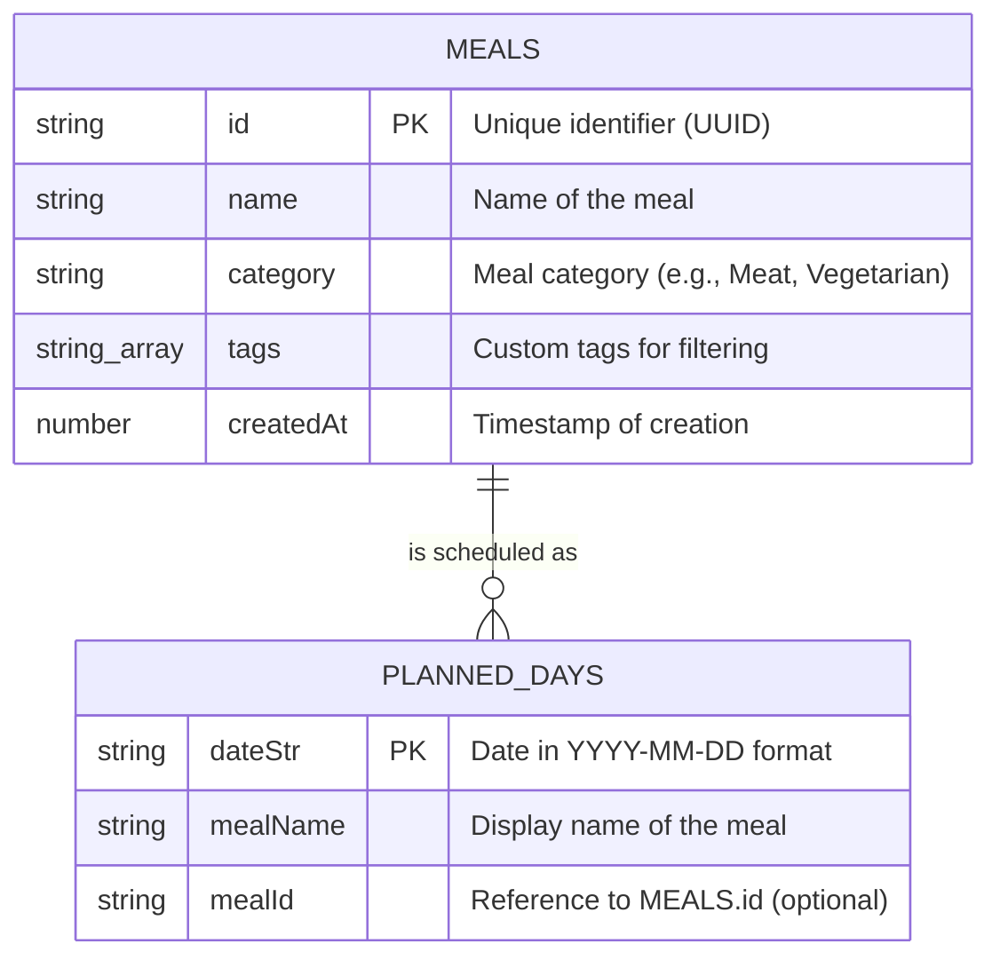

# Database Schema Reference

This document describes the database structure used in the Meal Planner application. The application utilizes [Dexie.js](https://dexie.org/), a minimalist wrapper for **IndexedDB**, ensuring all data is persisted locally in the browser.

## Overview

The database is named `MealPlannerDB` and consists of two primary tables: `meals` and `plannedDays`.



---

## Tables

### 1. `meals`
Stores the master list of meals that can be planned.

| Field | Type | Indexed | Description |
| :--- | :--- | :---: | :--- |
| `id` | `string` | Yes (PK) | Unique identifier for the meal. |
| `name` | `string` | Yes | The title of the dish. |
| `category` | `string` | Yes | High-level grouping (e.g., Pasta, Salad). |
| `tags` | `string[]` | Yes (*) | Multi-valued index for quick filtering by tags. |
| `createdAt` | `number` | Yes | Unix timestamp representing when the meal was added. |

> [!NOTE]
> The `tags` field is indexed as a multi-entry index, allowing efficient searches for specific tags within the array.

### 2. `plannedDays`
Stores the schedule of meals assigned to specific dates.

| Field | Type | Indexed | Description |
| :--- | :--- | :---: | :--- |
| `dateStr` | `string` | Yes (PK) | The date acting as the unique key, formatted as `YYYY-MM-DD`. |
| `mealName` | `string` | No | The name to display on the calendar (captured at time of planning). |
| `mealId` | `string` | Yes | Reference to a meal in the `meals` table. Can be empty if the meal was entered manually without a link to the index. |

---

## Relationships

- **Loose Coupling**: The `plannedDays` table references `meals` via `mealId`. 
- **Manual Entries**: If a user types a meal directly into the calendar without selecting one from the index, `mealId` will be undefined, but `mealName` will still persist the entry.
- **Data Persistence**: Both tables are stored locally in the browser's IndexedDB, making the app fully functional offline.

## Database Initialization

The schema is defined in [src/db.ts](file:///c:/Users/rikar/OneDrive/Skrivbord/Meal%20Planner/src/db.ts) using the following Dexie store configuration:

```typescript
this.version(2).stores({
  meals: 'id, name, category, *tags, createdAt',
  plannedDays: 'dateStr, mealId'
});
```
